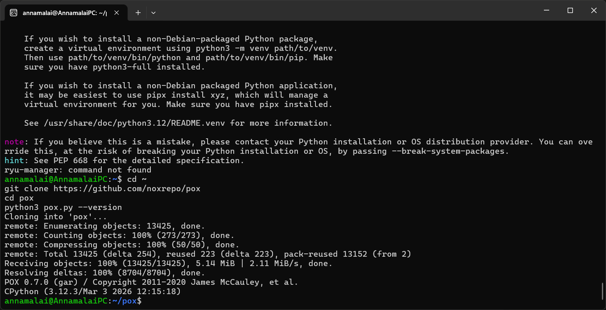
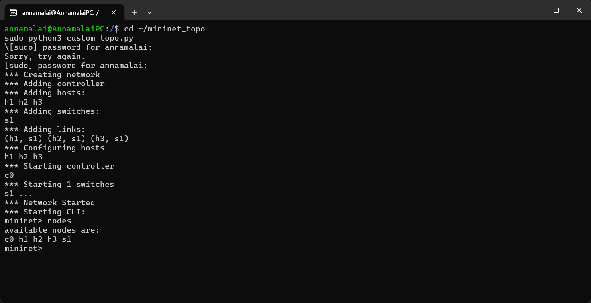
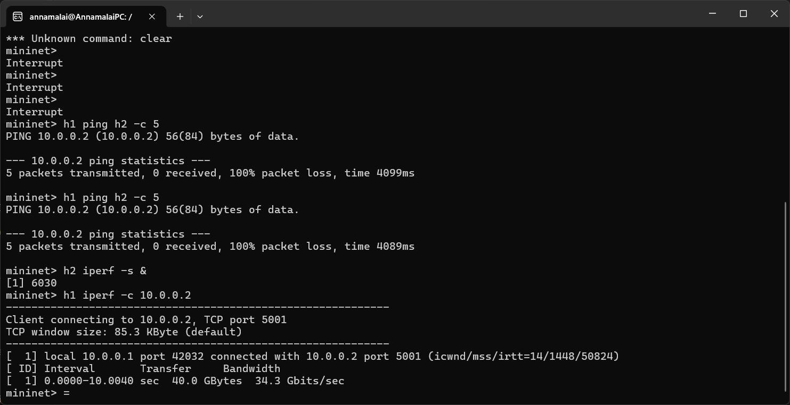
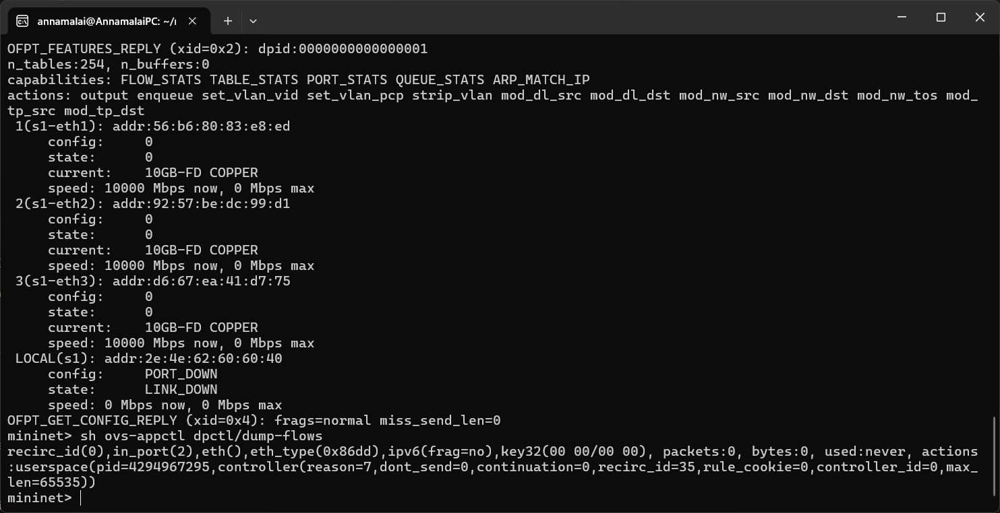
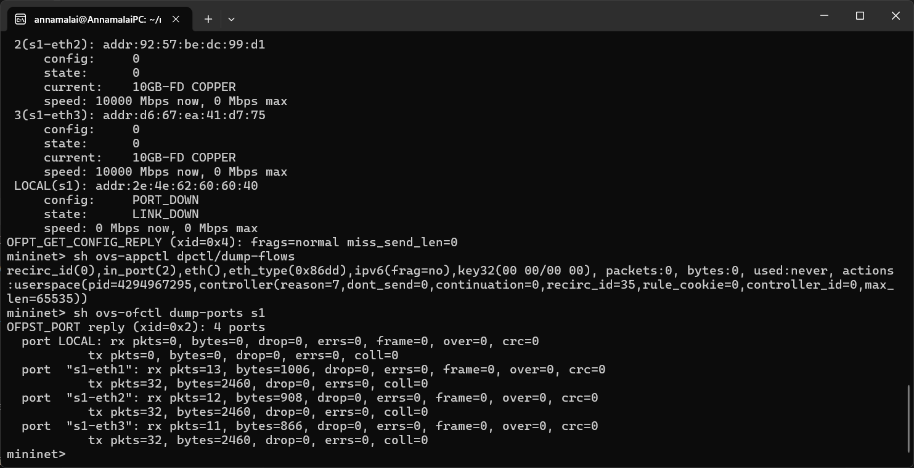
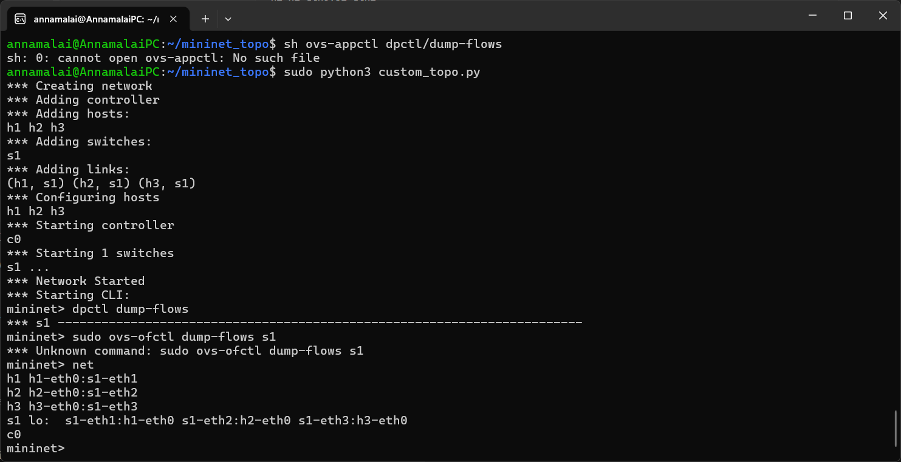
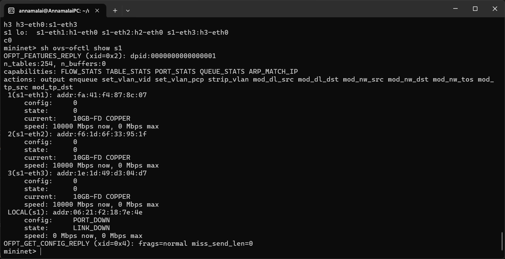
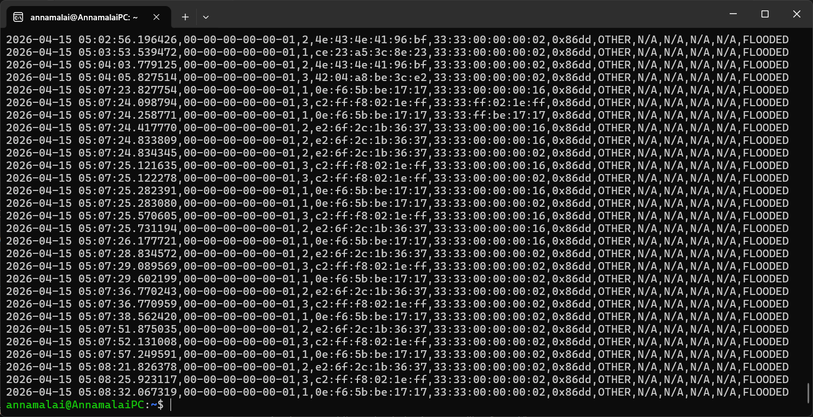

# SDN Packet Monitoring and Control using Mininet and POX

## What is this project? (Simple explanation)

In a normal network, each switch decides on its own how to forward packets — the rules are hardcoded in hardware. You cannot easily change them.

**SDN (Software Defined Networking)** changes this: it removes the decision-making brain from the switch and puts it in a Python program (the controller) running on your computer. The switch just asks "what should I do with this packet?" and the controller decides.

This project builds a small fake network using **Mininet** (a tool that simulates hosts, switches and cables entirely in software on Linux), controlled by **POX** (a Python SDN controller). The controller watches every packet, blocks ICMP (ping), allows TCP, and writes a log of everything.

---

## Problem Statement

This project implements a Software Defined Networking (SDN) solution using Mininet and the POX controller. The controller monitors network traffic, identifies protocols, blocks ICMP packets, allows TCP traffic, and logs packet information into a CSV file.

---

## Objective

- Demonstrate controller–switch interaction over OpenFlow
- Design match–action flow rules in software
- Observe and filter network traffic in real time
- Log all packet decisions to a CSV file for analysis

---

## Tools and Technologies Used

| Tool | Purpose |
|------|---------|
| Mininet | Simulates hosts, switches, and links entirely in software |
| POX Controller | Python-based SDN controller that installs flow rules |
| OpenFlow 1.0 | Protocol used for controller ↔ switch communication |
| Open vSwitch (OVS) | The software switch used inside Mininet |
| iperf | Measures TCP throughput between hosts |
| Python 3 | Language for the controller and topology scripts |
| Linux / WSL | Operating environment |

---

## Network Topology

```
         [ POX Controller ]
         127.0.0.1 : 6633
               |
           OpenFlow
               |
          [ s1 Switch ]
         /      |      \
     port1   port2   port3
       |        |        |
      h1       h2       h3
  10.0.0.1  10.0.0.2  10.0.0.3
```

- 3 hosts: h1, h2, h3
- 1 OVS switch: s1
- 1 remote controller: POX (c0)

---

## How SDN Works — Step by Step

1. h1 sends a packet → arrives at switch s1
2. s1 checks its flow table → no matching rule exists yet
3. s1 sends a **PacketIn** event to the POX controller
4. POX runs your Python code: learns MAC, identifies protocol, checks block list
5. **If ICMP:** installs a DROP rule → packet is thrown away
6. **If TCP/ARP and destination known:** installs FORWARD rule → packet delivered
7. **If destination unknown:** floods out all ports
8. Everything is written to `packet_log.csv`

---

## Project Files

### `custom_topo.py`

```python
from mininet.topo import Topo
from mininet.net import Mininet
from mininet.node import RemoteController, OVSSwitch
from mininet.cli import CLI
from mininet.log import setLogLevel, info

class PacketLoggerTopo(Topo):
    def build(self):
        h1 = self.addHost('h1', ip='10.0.0.1/24')
        h2 = self.addHost('h2', ip='10.0.0.2/24')
        h3 = self.addHost('h3', ip='10.0.0.3/24')
        s1 = self.addSwitch('s1')
        self.addLink(h1, s1)
        self.addLink(h2, s1)
        self.addLink(h3, s1)

def run():
    topo = PacketLoggerTopo()
    net = Mininet(
        topo=topo,
        controller=RemoteController('c0', ip='127.0.0.1', port=6633),
        switch=OVSSwitch
    )
    net.start()
    info("*** Network Started\n")
    CLI(net)
    net.stop()

if __name__ == '__main__':
    setLogLevel('info')
    run()
```

### `packet_logger.py` — Key logic

```python
BLOCKED_PROTOCOLS = ["ICMP"]   # change this to block any protocol

def _handle_PacketIn(self, event):
    mac_table[dpid][src_mac] = in_port               # Step 1: Learn MAC
    eth_type, protocol, ... = identify_protocol(packet)  # Step 2: Identify

    if protocol in BLOCKED_PROTOCOLS:
        install_flow_rule(event, None, protocol)      # Step 3: DROP
        return

    if dst_mac in mac_table[dpid]:
        install_flow_rule(event, out_port, protocol)  # Step 4: FORWARD
    else:
        flood(event)                                  # Step 4: FLOOD

    log_packet(...)   # Step 5: Log to CSV
```

---

## How to Run the Project

### Step 1 — Install and verify POX

```bash
cd ~
git clone https://github.com/noxrepo/pox
cd pox
python3 pox.py --version
```

**Screenshot — POX cloned and verified (POX 0.7.0):**



---

### Step 2 — Start the POX controller

Open **Terminal 1** and leave it running:

```bash
cd ~/pox
python3 pox.py log.level --DEBUG openflow.of_01 packet_logger
```

---

### Step 3 — Start the Mininet topology

Open **Terminal 2:**

```bash
cd ~/mininet_topo
sudo python3 custom_topo.py
```

**Screenshot — Mininet started, all nodes created:**



Mininet creates h1 h2 h3, switch s1, starts controller c0. The `nodes` command confirms: `c0 h1 h2 h3 s1`.

---

## Test Scenarios

### Test Scenario 1 — ICMP Blocked

```
mininet> h1 ping h2 -c 5
```

**Screenshot — 100% packet loss:**



**Result:**
```
5 packets transmitted, 0 received, 100% packet loss, time 4099ms
```

What happens: ARP resolves (FORWARDED), but ICMP is identified by the controller and a DROP rule is installed. All 5 pings are silently discarded.

---

### Test Scenario 2 — TCP Allowed

```
mininet> h2 iperf -s &
mininet> h1 iperf -c 10.0.0.2
```

**Screenshot — 34.3 Gbits/sec TCP throughput (same screenshot as above, scroll down):**


**Result:**
```
[ 1]  0.0000-10.0040 sec  40.0 GBytes  34.3 Gbits/sec
```

TCP is not in the blocked list. The controller installs a FORWARD rule and the switch handles all subsequent packets at full speed.

---

## Switch Verification

### View switch port details

```
mininet> sh ovs-ofctl show s1
```

**Screenshot:**



Confirms: port 1 = h1, port 2 = h2, port 3 = h3, all at 10GB-FD.

---

### View flow rules and port traffic statistics

```
mininet> sh ovs-appctl dpctl/dump-flows
mininet> sh ovs-ofctl dump-ports s1
```

**Screenshot:**



Shows real packet counts: s1-eth1 rx=13, s1-eth2 rx=12, s1-eth3 rx=11 — confirms real traffic flowed.

---

### View network wiring

```
mininet> net
```

**Screenshot:**



Confirms exact wiring: h1↔s1-eth1, h2↔s1-eth2, h3↔s1-eth3.

---

### Switch details (second run)

**Screenshot:**



Capabilities confirmed: FLOW_STATS, TABLE_STATS, PORT_STATS, QUEUE_STATS, ARP_MATCH_IP — all OpenFlow 1.0 features present.

---

## Packet Log

All traffic is automatically written to `~/packet_log.csv`.

**Screenshot — raw CSV output:**



### CSV columns

| Column | Meaning |
|--------|---------|
| timestamp | When the packet was seen |
| switch_dpid | Which switch (00-00-00-00-00-01 = s1) |
| in_port | Which port the packet came in on |
| src_mac | Source MAC address |
| dst_mac | Destination MAC address |
| eth_type | EtherType (0x0800=IPv4, 0x0806=ARP, 0x86dd=IPv6) |
| protocol | ARP / ICMP / TCP / UDP / OTHER |
| src_ip | Source IP |
| dst_ip | Destination IP |
| src_port | TCP/UDP source port |
| dst_port | TCP/UDP destination port |
| action | FLOODED / FORWARDED / BLOCKED |

### Log summary from actual run

| Action | Count | Explanation |
|--------|-------|-------------|
| FLOODED | 90 | IPv6 multicast (normal) + initial ARP broadcasts |
| FORWARDED | 8 | ARP replies + TCP packets both directions |
| BLOCKED | 3 | All ICMP from h1 to h2 |

---

## Key Results Summary

| Test | Command | Result | Proves |
|------|---------|--------|--------|
| ICMP blocked | `h1 ping h2 -c 5` | 100% packet loss | DROP rule works |
| TCP allowed | `h1 iperf -c 10.0.0.2` | 34.3 Gbits/sec | FORWARD rule works |
| Logging | `cat ~/packet_log.csv` | All packets recorded | CSV logging works |
| Flow rules | `sh ovs-ofctl dump-ports s1` | Packet counts visible | OpenFlow communication works |

---

## Conclusion

This project successfully demonstrates SDN-based traffic control using Mininet and the POX controller:

- ICMP is blocked by a single Python list — no hardware configuration needed
- TCP flows freely with high throughput
- MAC learning allows the switch to forward without flooding after the first packet
- Flow rules installed on the switch handle repeated traffic at full speed
- Every packet decision is logged to CSV for full visibility

This demonstrates the core SDN value: network intelligence in software, not locked in device hardware.
